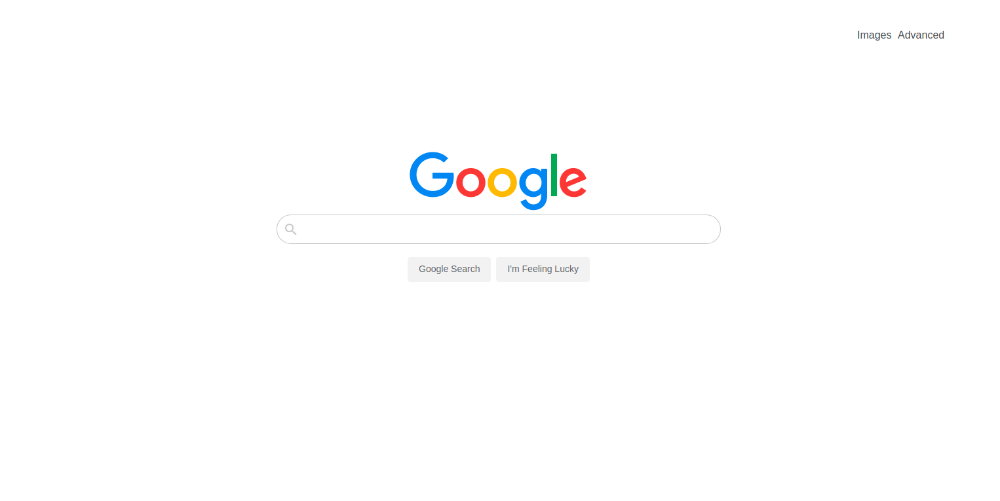

# CS50-Web-Project0
- Design a front-end for Google Search, Google Image Search, and Google Advanced Search.

### The aim of this project is to meet the following specifications

Your website must meet the following requirements.

- **Pages**. Your website should have at least three pages: one for Google Search, one for Google Image Search, and one for Google Advanced Search.
  - On the Google Search page, there should be links in the upper-right of the page to go to Image Search or Advanced Search. On each of the other two pages, there should be a link in the upper-right to go back to Google Search.
- **Query Text**. On the Google Search page, the user should be able to type in a query, click “Google Search”, and be taken to the Google search results for that page.
  - Like Google’s own, your search bar should be centered with rounded corners. The search button should also be centered, and should be beneath the search bar.
- **Query Images.** On the Google Image Search page, the user should be able to type in a query, click a search button, and be taken to the Google Image search results for that page.
- **Query Advanced.** On the Google Advanced Search page, the user should be able to provide input for the following four fields (taken from Google’s own advanced search options)
  - Find pages with… “all these words:”
  - Find pages with… “this exact word or phrase:”
  - Find pages with… “any of these words:”
  - Find pages with… “none of these words:”
- **Appearance.** Like Google’s own Advanced Search page, the four options should be stacked vertically, and all of the text fields should be left aligned.
  - Consistent with Google’s own CSS, the “Advanced Search” button should be blue with white text. When the “Advanced Search” button is clicked, the user should be taken to search results page for their given query.
- **Lucky.** Add an “I’m Feeling Lucky” button to the main Google Search page. Consistent with Google’s own behavior, clicking this link should take users directly to the first Google search result for the query, bypassing the normal results page.
- **Aesthetics.** The CSS you write should match Google’s own aesthetics as best as possible.

## Built With

- HTML,
- CSS3
## YouTube Demo

[Video_Link](https://youtu.be/CEvuM3jKlh8)

## Webpage

[Website](https://ggotora.github.io/CS50-Web-Project0/)

## Authors

👤 **Author**

[https://github.com/ggotora](https://github.com/ggotora)

## 🤝 Contributing

Contributions, issues and feature requests are welcome!

Feel free to check the [issues page](issues/).

## Show your support

Give a ⭐️ if you like this project!

## 📝 License

This project is [MIT](lic.url) licensed.
